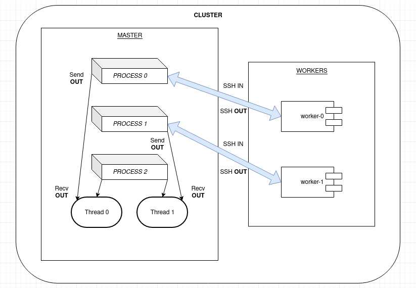

# RUBY CLUSTER

> __Author__::      TW-D
>
> __Version__::     1.0.0
>
> __Copyright__::   Copyright (c) 2021 TW-D
>
> __License__::     Distributes under the same terms as Ruby

## Description

A basic proof of concept for running smalls programs simultaneously on different hosts.

__Note :__ *"Issues" and "Pull Requests" are welcome.*

## Principle of operation



## General conditions

### For an offline cluster *(example)*

1 x Laptop with Ubuntu 20.04.3 LTS for MASTER

2 x Raspberry Pi 3 B+ with Raspberry Pi OS Lite for WORKERS

### For an online cluster *(example)*

Cloud Computing and Linux Servers.

## Requirements for MASTER

```bash
sudo apt-get install build-essential git ruby ruby-dev mpi-default-dev openssh-client openssh-server
sudo gem install ruby-mpi parallel net-ssh
sudo git clone https://github.com/TW-D/Ruby-Cluster.git
```

## Minimum requirements for WORKERS

```bash
sudo apt-get install openssh-client openssh-server sshpass
```

__Note :__ *You will be left with the installation of the dependencies necessary for the operation of your programs.*

## Usage

Edit the "cluster.rb" file to change :

- SSH information for MASTER and WORKERS.
```
    {
        'hostname' => "<HOSTNAME>",
        'username' => "<USERNAME>",
        'password' => "<PASSWORD"
        [...]
    }
```

- Program directory on the MASTER and command to start it.
```
    {
        [...],
        'program' => "<ABSOLUTE-PATH>",
        'command' => "<LAUNCH-COMMAND>"
    }
```

__Note :__ *This project allows you to have only one MASTER but as many WORKERS as you want.*

```ruby
require_relative('./classes/Cluster')

cluster = Cluster.new

cluster.set_master(
    {
        'hostname' => "master.home",
        'username' => "pi",
        'password' => "raspberry"
    }
)

cluster.add_worker(
    {
        'hostname' => "worker-0.home",
        'username' => "pi",
        'password' => "raspberry",
        'program' => (Dir.pwd + "/programs/worker-0/*"),
        'command' => "/usr/bin/bash ./main.sh"
    }
)

cluster.add_worker(
    {
        'hostname' => "worker-1.home",
        'username' => "pi",
        'password' => "raspberry",
        'program' => (Dir.pwd + "/programs/worker-1/*"),
        'command' => "/usr/bin/bash ./main.sh"
    }
)

cluster.run
```

In the configuration of this example file, we find :
```
(1 x MASTER) + (2 x WORKER) = 3
```

So you have to run this command from the MASTER :
```bash
mpirun --oversubscribe -np 3 /usr/bin/ruby ./cluster.rb
```